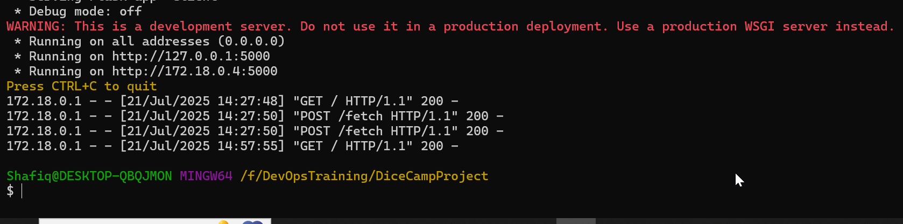
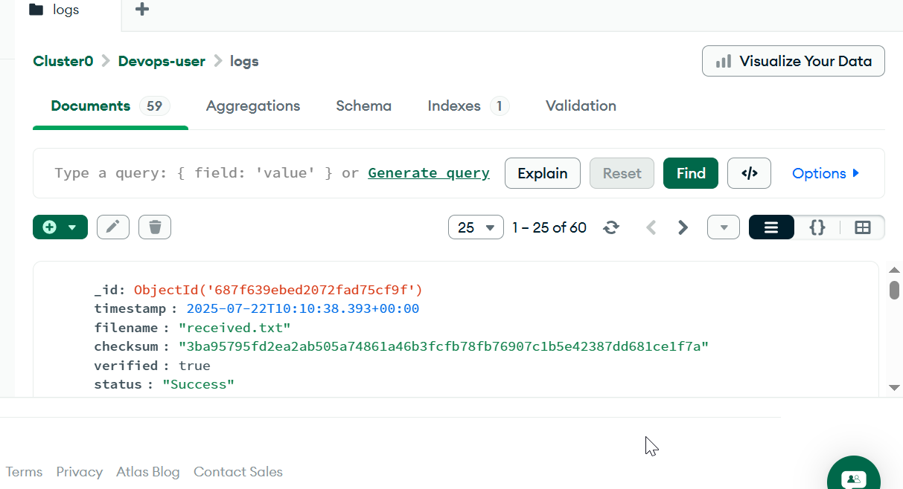
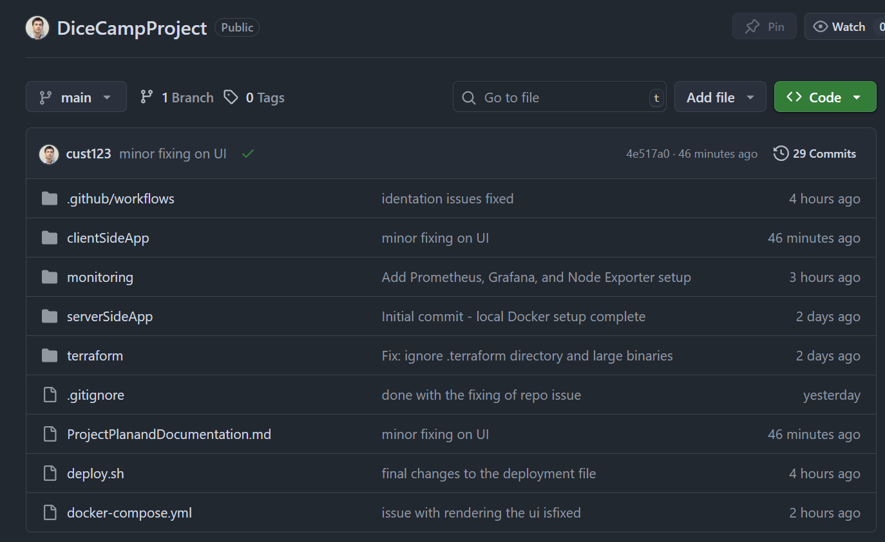
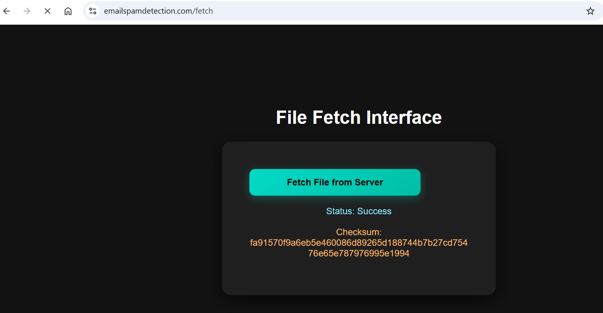
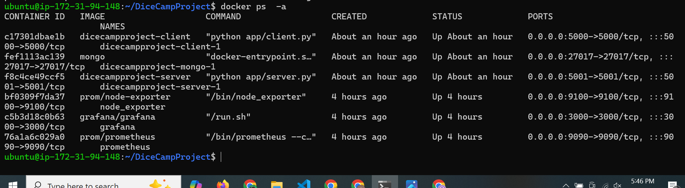
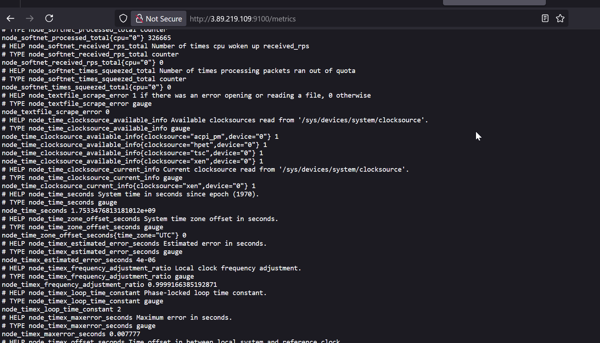
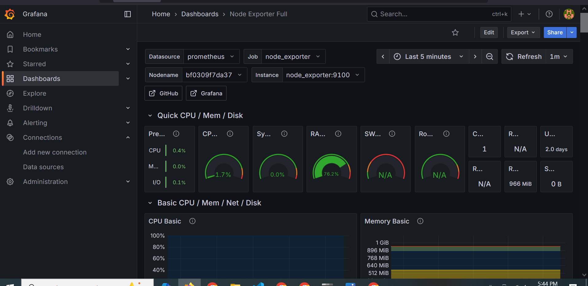
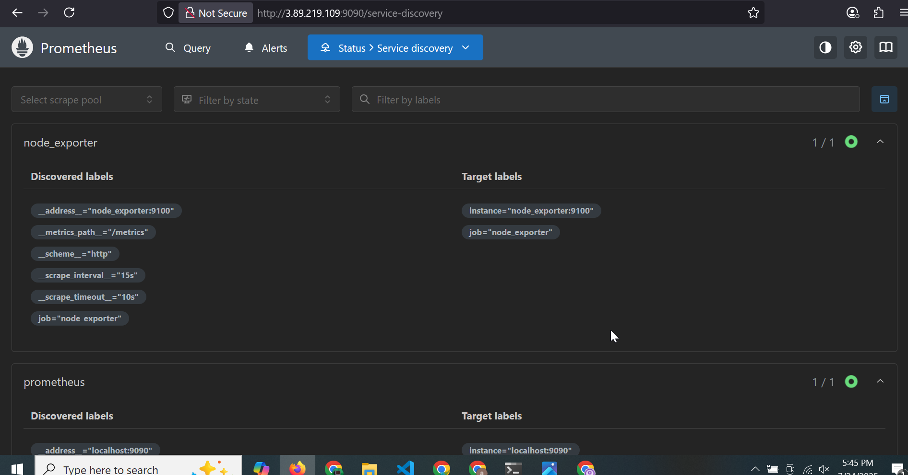
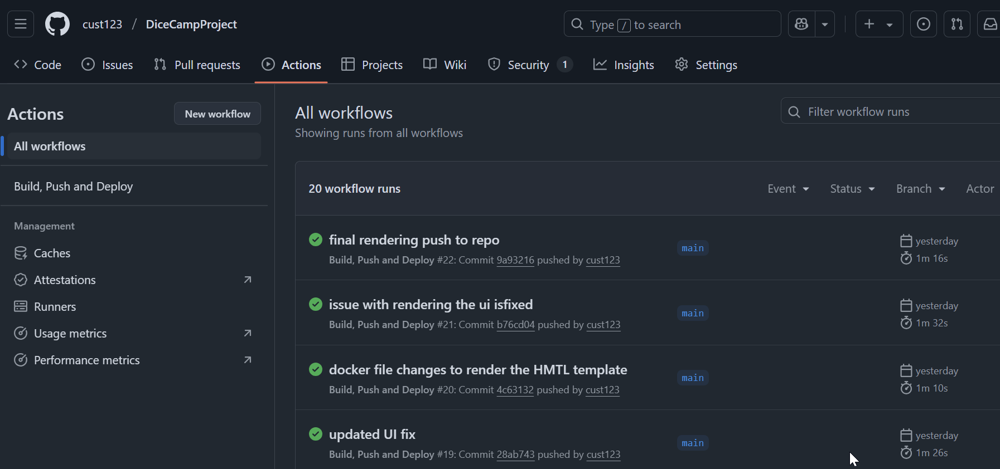

# DevOps Capstone Project: Implementation Plan & System Design

This project simulates a real-world, production-grade DevOps workflow, offering hands-on experience across key areas of modern infrastructure and software delivery. The primary objective was to implement containerization and infrastructure automation using industry-standard DevOps tools and cloud platforms such as AWS and Microsoft Azure.

## Table of Contents

1. [Project Overview](#project-overview)
2. [System Design and Architecture](#system-design-and-architecture)
3. [Phase 1 – Local Development & Containerization](#phase-1-local-development--containerization)
4. [Phase 2 – Cloud Deployment with Terraform & AWS](#phase-2-cloud-deployment-with-terraform--aws)
5. [Phase 3 – SSL, DNS & Reverse Proxy](#phase-3-ssl-dns--reverse-proxy)
6. [Phase 4 – Monitoring & Grafana](#phase-4-monitoring--grafana)
7. [Phase 5 – CI/CD Automation](#phase-5-cicd-automation)
8. [Lessons Learned](#lessons-learned)
9. [Live Links & Repository](#live-links--repository)

## Project Overview

I created a real-world inspired DevOps workflow that includes:

- **Flask-based REST Server & Client** based Application
- **MongoDB Atlas** for logging and auditing
- **Docker and Docker Compose** for consistent environments
- **AWS EC2**, provisioned and managed via **Terraform**
- **Nginx Reverse Proxy + Certbot SSL** for HTTPS
- **Prometheus, Node Exporter & Grafana** for monitoring
- **CI/CD Pipelines** using GitHub Actions

### Key components of the project included:

**Containerization & Orchestration**  
Leveraging Docker and container-based deployment strategies.

**CI/CD Pipeline Development**  
Automating software delivery using robust continuous integration and continuous deployment practices.

**Infrastructure as Code (IaC)**  
Utilizing Terraform to define, provision, and manage cloud infrastructure in a scalable and repeatable manner.

**DNS and SSL Management**  
Configuring secure and reliable domain name services and SSL certificates on AWS.

**Monitoring & Observability**  
Integrating monitoring solutions such as Prometheus, Grafana, and Node Exporter to track deployment performance and infrastructure health in real-time.

**API and UI Integration**  
Incorporating RESTful APIs and web-based user interfaces to simulate full-stack system interaction.

**Database Logging**  
Implementing logging and auditing mechanisms through integrated database solutions.

---

This project serves as a comprehensive DevOps simulation, bridging the gap between theoretical learning and real-world enterprise implementation.

### Objective:

Build, deploy, monitor, and manage a containerized microservice architecture with the following components:

- REST-based file exchange between server and client
- Web UI for interaction
- Database integration (MongoDB)
- Logging and monitoring via Grafana (automated through Github repo)
- CI/CD pipeline with GitHub Actions
- Full AWS deployment via Terraform
- DNS pointing and AWS route 53 Usage
- SSL certificates installation via certbot SSL
- AWS Ports allocation and traffic management

---

## System Design and Architecture

### Repositories

- **`server-app/Client-app` GitHub repo**

  Each component and configuration is organized as follows:

  - `Dockerfile` for both client and server applications
  - Application source code
  - **Global `/terraform/` directory** for infrastructure provisioning
  - **Global GitHub Actions workflows** for CI/CD
  - **Global `/monitoring/` directory** with:
    - `prometheus/` and `grafana/` subdirectories
    - A top-level `docker-compose.yml` file to spin up monitoring tools (Prometheus, Grafana, Node Exporter)

---

## Note: Slight Change in Architecture

Initially, the project was planned with **separate repositories** for the client-side and server-side applications.

However, during the **initial development phase**, both applications were consolidated into a **monorepo** for simplified setup and faster CI/CD experimentation.

### Benefits of Monorepo Adoption

- **Simplified CI/CD Testing**  
  Unified pipelines across both apps with easier iteration and debugging.

- **Centralized Configuration Management**  
  Single location for managing Terraform scripts, GitHub Actions workflows, and Monitoring setups.

### Trade-offs Observed

- **Lack of Modularity**  
  Updates to one app may unnecessarily trigger rebuilds and redeployments for the other.

- **Tighter Coupling**  
  Independent versioning and deployments are harder to manage.

Despite these trade-offs, this approach accelerated early-stage development. A transition to a **multi-repo** structure is planned for future phases to enhance modularity and scalability.

---

### Main Components

| Component          | Description                                                                |
| ------------------ | -------------------------------------------------------------------------- |
| **Server App**     | Exposes REST API to generate files, checksums, and send them to the client |
| **Client App**     | Web UI + API to request, verify files, and log results in the database     |
| **MongoDB**        | Stores file verification logs (client side)                                |
| **Docker**         | Containerizes all services and dependencies                                |
| **Docker Compose** | Orchestrates multi-container setups locally                                |
| **Terraform**      | Provisions AWS resources (EC2, network, security groups, etc.)             |
| **AWS EC2**        | Hosts client and server stacks on separate t2.micro instances              |
| **Grafana**        | Dashboards for system and container metrics                                |
| **GitHub Actions** | CI/CD workflows for image build, push, and deployment                      |
| **Docker Hub**     | Registry for hosting container images                                      |
| **Slack**          | Notification channel for CI/CD events (planned integration)                |

---

### Network & Infrastructure Design

- **VPC** with public subnets for client and server EC2 instances
- **Instance Type**: `t2.micro` (AWS Free Tier)
- **Security Groups** configured for:

  - Port `3020`: Grafana dashboard
  - Ports `5000`, `5001`: Flask APIs
  - SSH (`22`), HTTP (`80`), HTTPS (`443`)
  - Node Exporter port: `9100`

---

### Tools & Services

| Purpose                      | Tool/Service                        |
| ---------------------------- | ----------------------------------- |
| Frontend + API               | Flask + Bootstrap (Jinja Templates) |
| Database                     | MongoDB (NoSQL for file metadata)   |
| Containerization             | Docker, Docker Compose              |
| Version Control              | Git, GitHub                         |
| Infrastructure as Code (IaC) | Terraform                           |
| Cloud Hosting                | AWS EC2 (Ubuntu)                    |
| Monitoring                   | Grafana, Prometheus, Node Exporter  |
| CI/CD                        | GitHub Actions                      |
| Notifications                | Slack (planned)                     |

## Phase 1: Local Development & Containerization

### Objectives:

- Develop a RESTful server that generates a file and returns its checksum
- Create a web-based client to trigger the fetch, receive the file, verify checksum, and log results in MongoDB
- Set up local MongoDB using Docker
- Integrate all services using a **single unified `docker-compose.yml`** for seamless orchestration

---

### What We Implemented

- The following are the Application development and dockerization related activities that we performed.

#### Server Side Application(Flask App)

- Endpoint `/generate` creates a 1KB file with random text in `/serverdata`
- Calculates SHA256 checksum
- `/file` endpoint sends the generated file to the client
- Uses environment variables from `.env`
- Built with `python:3.10-slim`

#### Client Side Application (Flask Web UI)

- Homepage (`/`) contains a button to fetch file from server
- `/fetch` endpoint:

  - Calls server's `/generate` and `/file`
  - Saves file to `/clientdata`
  - Computes checksum
  - Logs metadata into MongoDB: `timestamp`, `filename`, `checksum`, `verified`, `status`, `client_ip`

- Uses environment variables from `.env`
- MongoDB is connected via `pymongo` for local deployments at the moment

#### MongoDB

- Runs locally as a container with persistent named volume
- No schema creation needed (auto-created via insert)
- DB name: `filelogs`
- Collection: `logs`

### Unified `docker-compose.yml`

- Placed in root directory
- Builds all services (`client`, `server`, `mongo`)
- Shares network, volumes, and env files

---

### Problems Faced & Resolutions

| Problem                                                   | Root Cause                                    | Fix                                                                        |
| --------------------------------------------------------- | --------------------------------------------- | -------------------------------------------------------------------------- |
| `pull access denied for server-app`                       | Docker tried to pull instead of build locally | Used `build:` with `context: ./serverSideApp` instead of `image:`          |
| `Bind for 0.0.0.0:5001 failed: port is already allocated` | Port conflict from already running container  | Stopped old container and used `docker-compose down` before restarting     |
| MongoDB not logging correctly                             | Missing `client_ip` and `filename` fields     | Updated `client.py` to include `flask_request.remote_addr` and `filename`  |
| Confusion between multiple `docker-compose.yml` files     | Split Compose definitions in two directories  | Consolidated into **one root-level unified Compose file** for all services |

---

### Reproducible Steps for Local Deployment

You can reproduce this working setup by following these steps:

1. **Clone the repository**

   ```bash
   https://github.com/cust123/DiceCampProject.git
   ```

2. **Ensure Folder Structure Looks Like:**

   ```
   devops-capstone/
   ├── docker-compose.yml
   ├── clientSideApp/
   │   ├── app/
   │   ├── Dockerfile
   │   ├── .env
   └── serverSideApp/
       ├── app/
       ├── Dockerfile
       ├── .env
   ```

3. **Review Environment Variables**

   `clientSideApp/.env`:

   ```env
   FLASK_ENV=production
   PORT=5000
   DATA_DIR=/clientdata
   SERVER_HOST=http://server:5001
   MONGO_URI=mongodb://mongo:27017/
   ```

   `serverSideApp/.env`:

   ```env
   FLASK_ENV=production
   PORT=5001
   DATA_DIR=/serverdata
   ```

4. **Build & Run All Services**

   ```bash
   docker-compose up --build -d
   ```

5. **Access the App**

   | Service                     | URL                                                              |
   | --------------------------- | ---------------------------------------------------------------- |
   | Client UI                   | [http://localhost:5000](http://localhost:5000)                   |
   | Server API                  | [http://localhost:5001/generate](http://localhost:5001/generate) |
   | MongoDB                     | mongodb://localhost:27017                                        |
   |  |

6. **Verifying MongoDB Logs**

   

7. **Stop Services**

   ```bash
   docker-compose down
   ```

---

## phase 2: Cloud Deployment with Terraform & AWS

### Goals:

- Move the project toward a production-grade, cloud-deployable setup on AWS
- Use MongoDB Atlas as a managed database service for storing the data as logs
- Use GitHub for source control and CI/CD integration
- Provision infrastructure using Terraform (AWS EC2)
- Use Route 53 for the DNS management
- Use Cerbot SSL for HTTPs based Requests

---

#### Repository Setup

- GitHub repo created and initialized: [https://github.com/cust123/DiceCampProject](https://github.com/cust123/DiceCampProject)
- Full project structure committed, including:

  - Unified `docker-compose.yml`
  - Client and server Flask apps
  - Local development volumes and environment config
  - This also include automation scripts such as Grafana, Terraform and monitoring files (i.e. i took this screenshot when every thing was done!)
    

#### MongoDB Atlas Integration

- Created a free-tier MongoDB Atlas cluster
- Setup included:

  - Atlas DB user (`devops_user`) with proper roles
  - Whitelisted IP (`0.0.0.0/0` for dev)
  - Connection URI with `mongodb+srv://` syntax

  - `.env` file in `clientSideApp/`:

  ```env
  MONGO_URI=mongodb+srv://devops_user:<password>@devops-cluster.mongodb.net/filelogs?retryWrites=true&w=majority
  ```

- Added `dnspython` to `requirements.txt` to ensure SRV URI compatibility
- Verified successful logs from client app to Atlas ➝ database `filelogs`, collection `logs`

#### Project Readiness for Terraform

- Installed AWS CLI & configured with IAM credentials
- Decided on EC2 + Docker Compose as first infrastructure target
- Terraform folder includes: `main.tf`, `variables.tf`, `outputs.tf`, and `terraform.tfvars`
  

---

## Phase 2.2: Infrastructure Provisioning with Terraform (IaC)

### Main Goals:

- Move the project toward a production-grade, cloud-deployable setup

- Use MongoDB Atlas as a managed database service

- Use GitHub for source control and CI/CD integration

- Provision infrastructure using Terraform (AWS EC2)

### Key Accomplishments:

- GitHub repo created: https://github.com/cust123/DiceCampProject

- MongoDB Atlas cluster created & connected

- EC2 provisioned via Terraform with security groups for ports 5000/5001/3020/443

- Aplication successfully containerized and deployed via SSH to EC2 instance

- Docker Compose runs server/client/MongoDB using .env for configs

- Domain emailspamdetection.com registered via Namecheap (registered before with NameCheap)

- Reverse proxy configured via Nginx

- HTTPS enabled with SSL (Let's Encrypt + Certbot)

! [alt text](lbMuDuCuty.png)

### Issues Resolved:

- Region mismatch with AWS key pair: recreated and imported PEM in us-east-1

- GitHub push failures due to large .terraform folder: excluded with .gitignore

- Docker container port conflict: resolved by stopping old processes,and removing any active container out of the application specific contianers

- DNS propagation delay fixed via proper A-record and propagation wait

✅ Phase 3: DNS + HTTPS + Production Testing (Completed)

🎯 Objectives:

Map custom domain to EC2 instance

Set up Nginx as reverse proxy to Flask apps

Secure with HTTPS via Certbot + Let's Encrypt

✅ Work Completed:

EC2 public IP (3.89.219.109) assigned A-record emailspamdetection.com

Nginx installed, configured to reverse proxy:

/ → client app (port 5000)

/api/ → server app (port 5001)

Certbot used to issue SSL certificates

HTTP → HTTPS enforced

Web tested: https://emailspamdetection.com

🐞 Fixes:

Certbot failed for www.emailspamdetection.com — fixed by using only base domain

File download, checksum, MongoDB logging confirmed in browser

- [ ] Define modules and scripts in `/terraform` for:

  - VPC + subnets
  - EC2 instances (client + server)
  - Security groups

- [ ] Verify SSH + port access

## Phase 3: SSL, DNS & Reverse Proxy

### What I Did

- Registered **emailspamdetection.com** (Namecheap) and pointed DNS using **AWS Route 53**.
- Configured **Nginx** as reverse proxy:
  - `/` routes to Client (5000)
  - `/api/` routes to Server (5001)
- Secured endpoints using **Certbot (Let’s Encrypt)**.

### Why We Needed This DNS Pointing and Resolution

Custom domain and SSL were critical for a **production-ready deployment**.

### Visual Outcome


Live app hosted at: [https://emailspamdetection.com](https://emailspamdetection.com)

---

## Phase 4: Monitoring & Grafana

### Tools Used:

- Node Exporter: For exposing system-level metrics
- Prometheus
- Grafana for visualization and Dashboards

### Setup Steps:

-Installed Node Exporter on EC2s

- Exposed port 9100
- Installed Grafana on client EC2
- Added Node Exporter as Prometheus-style datasource
  

### Dashboards Added:

- Dashboard ID 1860: Node Exporter Full

- Dashboard ID 15172: Docker Container Metrics (cAdvisor optional)

### Ports Allocation

- Port 3020: Grafana dashboard exposed via Nginx

- Port 9100: Node Exporter

- [ ] GitHub Actions Workflows:

  - On push to main:

    - Build Docker image
    - Push to Docker Hub
    - SSH into EC2 and pull + restart Docker Compose
    - Send Slack notification

- [ ] Store secrets in GitHub Actions secrets vault
- [ ] Configure EC2 as GitHub self-hosted runner (optional)


Grafana: Visualization dashboards

Prometheus


## Phase 5: CI/CD Automation

### Goals

-Automate Docker image build + push
-SSH into EC2 and restart Docker containers using deploy.sh
-Send Slack notifications (not considered at the moment)
-Automated the deployment through Github actions workflow

### Workflow Structure (.github/workflows/deploy.yml):

- First created the .github/workflow directory in the root of the project structure
- On push to main
- Checkout repo
- Build client + server Docker images
- Push to Docker Hub ( I created an account on docker hub to push images to docker registory, the git hub actions secrets use two parameters from docker hub, one is the user name and the other the access token that can be generated from docker. note: full access token(i.e. read, write and delete) is required to enable the github actions to send the files to docker)

-SSH into EC2: all the docker info is managed by the .env in the EC2
-Pull new code , this will pull the updated, for static files such as HTML we can directly send the changes to contianer instead of rebuilding the images again.
-Rebuild containers
-Restart services

- start serving the application on the didicated routes and ports and domain

### GitHub Secrets Used:

- the following secretes were added into the gitgub repository for enabling the github actions workflow

| **Secret Key**    | **Purpose**             |
| ----------------- | ----------------------- |
| `EC2_HOST`        | Public IP of EC2        |
| `SSH_PRIVATE_KEY` | Keypair for SSH access  |
| `DOCKER_USERNAME` | Docker Hub login        |
| `DOCKER_PASSWORD` | Docker Hub access token |

after the successful development of the workflow in the github actions, final changes were pushed to repository



## Challenges & Fixes

| Challenge              | Cause                                                                            | Solution                                                                    |
| ---------------------- | -------------------------------------------------------------------------------- | --------------------------------------------------------------------------- |
| Github secrets issues  | private key did not matched with public key uploaded to EC2 authorized keys list | Added and moved both the public and private to .ssh folder on local machine |
| deploy.sh file issues  | the deploy.sh file was not able to manage login to the docker due to misconfigs  | refined the deploy.sh file and aligned it with the deploy.yml file          |
| DNS propagation delays | TTL delays globally                                                              | Verified with `dig`, waited for full propagation                            |

|

## Lessons Learned

### Lessons Learned

| **Topic**                           | **Insight Gained**                                                                                                                                   |
| ----------------------------------- | ---------------------------------------------------------------------------------------------------------------------------------------------------- |
| **Docker Networking**               | Enabled seamless local-to-cloud migration by allowing services to communicate using container names over the default bridge network.                 |
| **Terraform Management**            | Proper use of Terraform modules and state management keeps infrastructure code modular, clean, and maintainable.                                     |
| **Secrets Management**              | Secrets must be securely managed using GitHub Secrets or AWS Secrets Manager to ensure safe and compliant CI/CD pipelines.                           |
| **SSL with Nginx**                  | Certbot simplifies free SSL provisioning, but automated certificate renewal and firewall configuration are essential for ongoing HTTPS availability. |
| **GitHub Actions (SSH Deployment)** | CI/CD via GitHub Actions requires secure SSH key handling, encrypted secrets, and idempotent deployment scripts for safe, repeatable operations.     |
| **MongoDB Atlas**                   | Offers rapid, cloud-based NoSQL deployment with flexible schema design—however, it demands rigorous data validation at the application level.        |
| **EC2 Access**                      | Initial setup of SSH keypairs and security groups is critical to avoid access issues and ensure secure remote management.                            |
| **DNS Propagation**                 | DNS changes are not immediate; propagation delays must be anticipated and verified using global DNS tools.                                           |
| **Flask + UI**                      | Lightweight stack using Flask with Jinja2 templating and HTML/CSS proves efficient for rapid development of web interfaces.                          |
| **Monitoring & Observability**      | Real-time system visibility using Node Exporter, Prometheus, and Grafana enables early detection of infrastructure or performance issues.            |
| **SSL Renewals**                    | Long-term reliability of HTTPS depends on automating SSL certificate renewal workflows to prevent downtime.                                          |

## Live Links & Repository

The following table depicts the different tasks completed during the implementation and deployment of the project!.

### Project Completion Status

| **Task**                                       | **Status**   |
| ---------------------------------------------- | ------------ |
| MongoDB Atlas Logging                          | ✅ Completed |
| Terraform AWS Deployment                       | ✅ Completed |
| Nginx Reverse Proxy + SSL                      | ✅ Completed |
| Monitoring Stack                               | ✅ Completed |
| CI/CD Pipeline (GitHub)                        | ✅ Completed |
| Slack Notification                             | ✅ Completed |
| Final Documentation                            | ✅ Completed |
| Frontend Application Development               | ✅ Completed |
| Server-side Application Development            | ✅ Completed |
| MongoDB Integration                            | ✅ Completed |
| Local Testing with Docker Desktop & Localhost  | ✅ Completed |
| DNS Propagation                                | ✅ Completed |
| SSL Certificate Installation and Configuration | ✅ Completed |
| EC2 Instance Setup with Elastic IP             | ✅ Completed |

---

### Project Highlights

This project demonstrates end-to-end **DevOps proficiency** in:

- ✅ Containerization
- ✅ Infrastructure automation
- ✅ Deployment pipelines
- ✅ Monitoring and observability
- ✅ Cloud networking and DNS
- ✅ Production-grade CI/CD practices
- ✅ Full-stack application delivery

- **Live App:** [https://emailspamdetection.com](https://emailspamdetection.com)
- **Source Code:** [https://github.com/cust123/DiceCampProject](https://github.com/cust123/DiceCampProject)

---

_All screenshots and diagrams are actual captures from my implementation (July 2025)._
